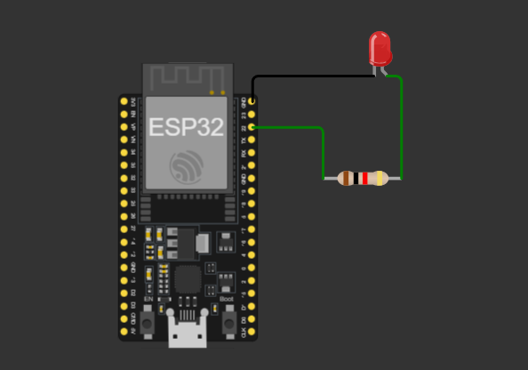

# ESP32 Wi-Fi LED Control System

## Description
This project uses an ESP32 as a web server to control an LED over Wi-Fi.
A webpage hosted by the ESP32 provides ON and OFF buttons that allow a user
to remotely switch the LED using a browser.

The project demonstrates basic IoT communication using HTTP requests.

## Simulation
Wokwi link: https://wokwi.com/projects/463564967259388929

## Circuit Diagram

## Components Used
- ESP32 Development Board
- LED
- 220Ω Resistor
- Breadboard
- Jumper wires

## How It Works
- ESP32 connects to a Wi-Fi network
- A web server is created on port 80
- A browser accesses the ESP32 IP address
- Pressing ON sends an HTTP request to turn the LED ON
- Pressing OFF sends an HTTP request to turn the LED OFF

NOTE: the project was performed with real components ,the wokwi link is to show the circuit connection.

## Learning Outcomes
- ESP32 Wi-Fi communication
- HTTP request handling
- Embedded web server implementation
- GPIO output control
- Basic IoT system development

## Author
Dickson Kabiru  
Control & Instrumentation Student
