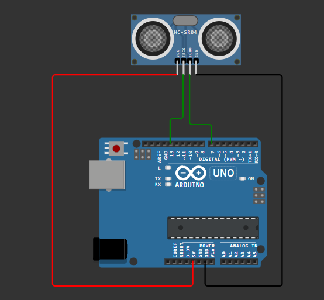

# Ultrasonic Distance Measurement Using Arduino

## Description
This project measures the distance of an object using an ultrasonic sensor
(HC-SR04) and an Arduino. The distance is calculated based on the time taken
for an ultrasonic pulse to travel to the object and reflect back to the sensor.

The project was simulated using Wokwi.

## Simulation
Wokwi link: https://wokwi.com/projects/449705123229220865

## Circuit Diagram

## Components Used
- Arduino Uno
- Ultrasonic Sensor (HC-SR04)

## How It Works
- The Arduino sends a short trigger pulse to the ultrasonic sensor
- The sensor emits an ultrasonic wave
- The wave reflects off an object and returns to the sensor
- The Arduino measures the echo time
- Distance is calculated using the speed of sound

## Distance Calculation
The distance is calculated using the formula:

Distance = (Duration(Time) × Speed of Sound) / 2

Where:
- Speed of sound ≈ 343 m/s
- Time is the echo pulse duration

## Learning Outcomes
- Interfacing ultrasonic sensors with Arduino
- Using digital input/output pins
- Timing measurements using microseconds
- Applying physics concepts in embedded systems
- Simulation-based testing and verification

## Author
Dickson Kabiru  
Control & Instrumentation Engineering Student
