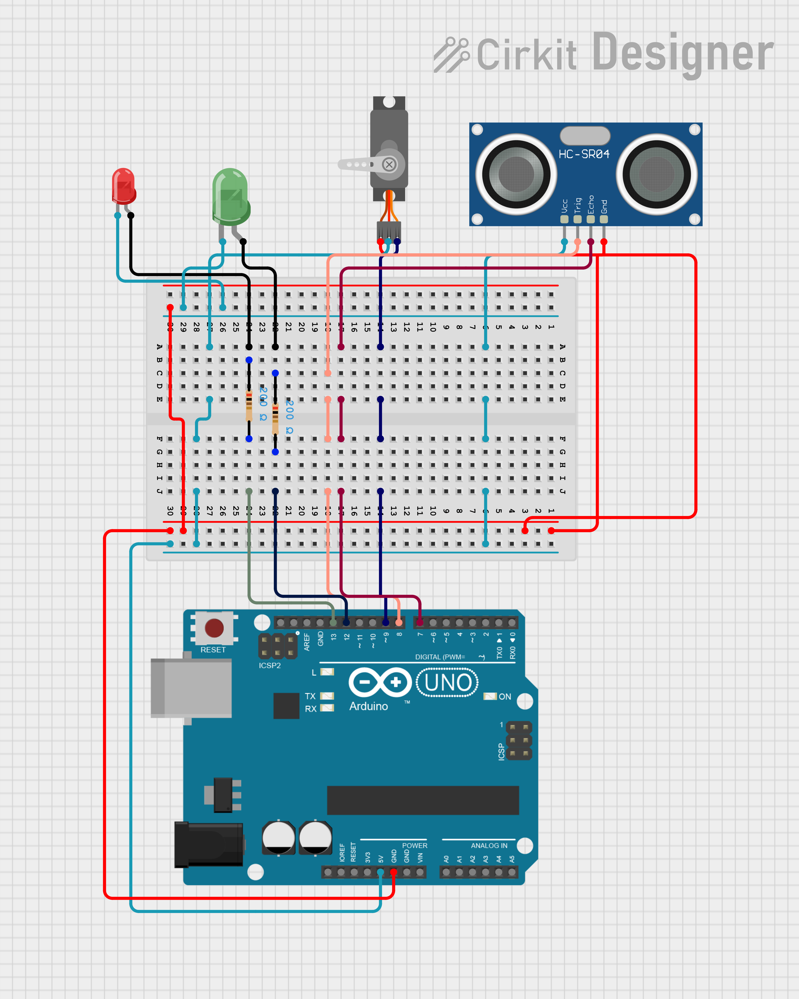

# Ultrasonic-Based Servo Access Control System

## Description
This project implements an automatic access control system using an ultrasonic
sensor and a servo motor. The system measures the distance of an object, and when
the distance is less than 20 cm, the servo motor opens. When the object moves away,
the servo closes.

LED indicators are used to show the system state:
- Red LED ON when the servo is closed
- Green LED ON when the servo is open

The project was simulated using Cirkit Designer IDE

## Simulation
Cirkit Designer IDE link: https://app.cirkitdesigner.com/project/32cc162e-8a97-4897-ac04-3d7613c6c1a7

## Circuit Diagram


## Components Used
- Arduino Uno
- Ultrasonic Sensor (HC-SR04)
- Servo Motor
- Red LED
- Green LED
- 2 × 200Ω Resistors
- Breadboard
- Jumper wires

## How It Works
- The Arduino triggers the ultrasonic sensor to measure distance
- The echo time is converted into distance in centimeters
- If the measured distance is less than 20 cm:
  - The servo rotates to the open position
  - The green LED turns ON
  - The red LED turns OFF
- If the distance is 20 cm or greater:
  - The servo rotates to the closed position
  - The red LED turns ON
  - The green LED turns OFF

## Control Logic
```text
IF distance < 20 cm
    Open servo
    Green LED ON
    Red LED OFF
ELSE
    Close servo
    Red LED ON
    Green LED OFF
END IF

##Author
Dickson Kabiru
Control & Instrumentation Engineering Student
